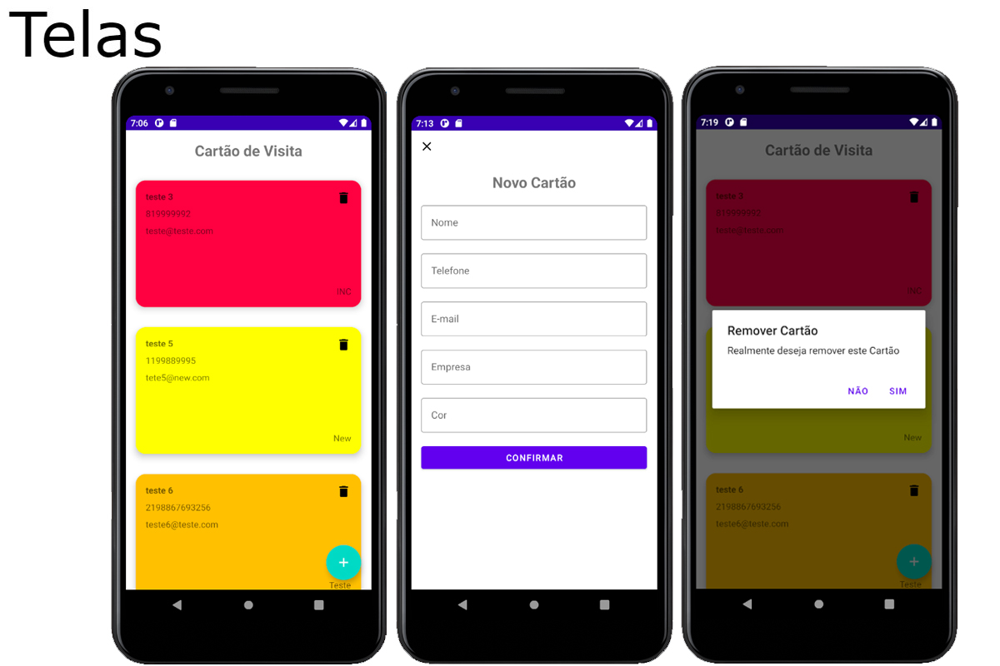

# App de Cartão de Visitas em Kotlin 

OLA"  bem vindo 

Este foi o projeto entregue no Bootcamp do Banco Inter na DIO.

O objetivo do projeto é criar um Aplicativo de lista de cartão de visita onde é possível manter os dados nome, empresa, telefone de contato, e-mail e cor de fundo do cartão utilizando banco de dados Room.

Neste projeto foi utilizado View Binding, Room , MVVM, LiveData, ListAdapter, Material Desing.

Acrescentei a funcionalidade de poder Remover o Cartão.

Fiquem a vontade para olhar estou aberto  a dicas e sugestões.

